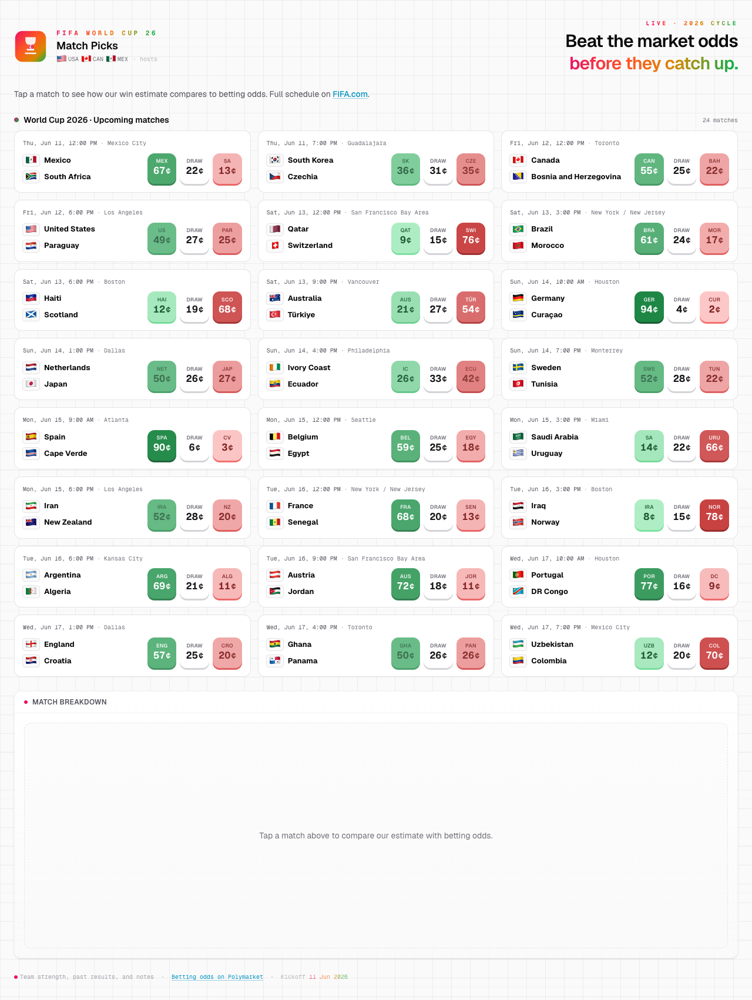

<p align="center">
  <strong>World Cup 2026 Match Picks</strong><br />
  <sub>Compare our win estimates to Polymarket — before the market catches up.</sub>
</p>

<p align="center">
  <a href="#quick-start">Quick start</a> ·
  <a href="#screenshot">Screenshot</a> ·
  <a href="#how-it-works">How it works</a> ·
  <a href="#configuration">Configuration</a> ·
  <a href="#api">API</a>
</p>

---

## Screenshot

<p align="center">
  
</p>

<p align="center">
  <em>Tap any match for a breakdown: our estimate vs market, venue context, news headlines, and optional AI notes.</em>
</p>

---

## Quick start

Works with **no API keys** — bundled demo matches and seed ratings.

```bash
git clone <your-repo-url>
cd wc26-alpha-agent
npm install
npm run dev
```

Open [http://localhost:3000](http://localhost:3000).

Optional features use a **local** `.env.local` file (never committed). Create it yourself when you need live data, AI, or news headlines — see [Configuration](#configuration).

---

## How it works

Each match analysis runs through:

| Step | What it does |
|------|----------------|
| **Ratings** | Elo + head-to-head baseline |
| **History** | Keyword search over past international results |
| **Venue** | Host city, altitude, heat, travel (WC26 schedule + venue profiles) |
| **Market** | Polymarket home / draw / away prices |
| **News** | Headlines from GNews / NewsAPI *(optional)* |
| **AI analyst** | Reads everything above and sets **Our estimate** *(optional)* |

Without AI, **Our estimate** blends ratings with history when enough past meetings exist. News headlines inform the UI and AI but do not change the headline number today.

---

## Configuration

All secrets stay in `.env.local` on your machine. The repo does not ship an env template file.

### Always free (no keys)

| Data | Source |
|------|--------|
| Match list & odds | [Polymarket](https://polymarket.com/sports/fifa-world-cup/games) Gamma API |
| Schedule fallback | `FOOTBALL_DATA_ORG_TOKEN` — [football-data.org](https://www.football-data.org/client/register) |

### History & venues

```bash
# 1. Download Kaggle CSV → data/results.csv (gitignored)
# 2. Build ratings + RAG chunks
npm run data:build -- --file data/results.csv

# Refresh official host cities
npm run wc26:venues
```

### AI analyst (pick one)

**Gemini**

| Variable | Purpose |
|----------|---------|
| `GOOGLE_GENERATIVE_AI_API_KEY` | API key from [Google AI Studio](https://aistudio.google.com/app/apikey) |
| `GEMINI_ANALYST_MODEL` | Optional model override |

**Ollama (local)**

| Variable | Purpose |
|----------|---------|
| `LLM_PROVIDER` | Set to `ollama` |
| `OLLAMA_MODEL` | e.g. `llama3.2` |
| `OLLAMA_BASE_URL` | Default `http://127.0.0.1:11434/api` |

Disable per request: `"include_llm": false` on `POST /api/analyze`.

### News headlines

| Variable | Purpose |
|----------|---------|
| `GNEWS_API_KEY` | [gnews.io](https://gnews.io/) |
| `NEWS_API_KEY` | Optional fallback — [newsapi.org](https://newsapi.org/) |
| `SENTIMENT_CACHE_TTL_MS` | Cache TTL in ms (default 6 hours) |

Pre-warm cache:

```bash
npm run sentiment:ingest
```

Disable per request: `"include_sentiment": false`.

---

## API

| Route | Method | Description |
|-------|--------|-------------|
| `/api/matches` | GET | Match list + Polymarket prices (~5m cache) |
| `/api/analyze` | POST | Full breakdown for one fixture |

**`POST /api/analyze`** — JSON body:

| Field | Required | Notes |
|-------|----------|-------|
| `home`, `away` | yes | Canonical names (`lib/teams.ts`) |
| `kickoff_iso` | yes | ISO datetime |
| `p_market`, `market_draw`, `market_away_win` | no | Client-side odds |
| `polymarket_event_slug` | no | Polymarket event |
| `venue` | no | Stadium / city hint |
| `include_llm` | no | Default on when AI configured |
| `include_sentiment` | no | Default on when news API keys configured |

---

## Scripts

```bash
npm run dev
npm run build
npm run data:build -- --file data/results.csv
npm run wc26:venues
npm run sentiment:ingest
npm test
npm run typecheck
```

---

## Project layout

```
app/                    Dashboard, match grid, breakdown panel
app/api/                matches + analyze routes
lib/alpha-engine.ts     Analysis pipeline
lib/sentiment/          News headline fetch + aggregation
lib/llm-analyst.ts      Optional AI layer
lib/match-context.ts    Venue & environment
data/processed/         Built ratings, history, sentiment cache
docs/screenshot.png     README preview image
```

---

## Verify real data

| UI | Demo | Fully wired |
|----|------|-------------|
| Match grid | Sample fixtures | Polymarket live list |
| Our estimate | Ratings only | History blend or AI |
| News headlines | Hidden | GNews and/or NewsAPI keys |
| Polymarket odds | Missing on tile | Home / draw / away |
| `elo-ratings.json` | `seed-ratings` | `csv:…` after `data:build` |

---

<p align="center">
  <sub>Built with Next.js · Not financial advice · Polymarket is a third-party market</sub>
</p>
